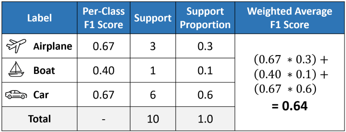

### Overfitting vs Underfitting

**Overfitting** happens when your model is too complex. For example, if you are training a deep neural network with a very small dataset like dozens of samples, then there is a high chance that your model is going to overfit. 

**Underfitting** happens when your model is too simple. For example, if your linear regression model trying to learn from a very large data set with hundreds of features. 

Few solutions for model overfit:

- **Reduce the network’s capacity** by removing layers or reducing the number of elements in the hidden layers.
- Apply **regularization**, which comes down to adding a cost to the loss function for large weights.
- Use **Dropout layers**, which will randomly remove certain features by setting them to zero.

[Ref](https://towardsdatascience.com/handling-overfitting-in-deep-learning-models-c760ee047c6e)

### Bias-Variance Trade-off

**Bias** is error due to wrong or overly **simplistic assumptions** in the learning algorithm you’re using. This can lead to the **model underfitting** your data, making it hard for it to have high predictive accuracy and for you to generalize your knowledge from the training set to the test set.

**Variance** is error due to too **much complexity** in the learning algorithm you’re using. This leads to the algorithm being highly sensitive to high degrees of variation in your training data, which can lead your model to **overfit** the data. You’ll be carrying too much noise from your training data for your model to be very useful for your test data.

The bias-variance decomposition essentially decomposes the learning error from any algorithm by adding the bias, the variance and a bit of irreducible error due to noise in the underlying dataset. Essentially, if you make the model more complex and add more variables, you’ll lose bias but gain some variance — in order to get the optimally reduced amount of error, you’ll have to tradeoff bias and variance. You don’t want either high bias or high variance in your model.

- Too simple model  -> model underfit -> Bias
- Too complex model -> model overfit -> Variance 

### Parameter vs Hyperparameter

Parameters are estimated or learned from data. They are not manually set by the practitioners. For example, model **weights** in ANN.  

Hyperparameters are set/specified by the practitioners.  They are often tuned for a given predictive modeling problem. For example, 

- The K in the K-nearest neighbors
- Learning rate
- Batch size
- Number of epochs 

### Data Lake

A data lake is a centralized repository that allows you to store all your **structured and unstructured data** at any scale.

|    Characteristics    |                        Data Warehouse                        |                          Data Lake                           |
| :-------------------: | :----------------------------------------------------------: | :----------------------------------------------------------: |
|       **Data**        | Relational from transactional systems, operational databases, and line of business applications | Non-relational and relational from IoT devices, web sites, mobile apps, social media, and corporate applications |
|      **Schema**       |  Designed prior to the DW implementation (schema-on-write)   |       Written at the time of analysis (schema-on-read)       |
| **Price/Performance** |       Fastest query results using higher cost storage        |     Query results getting faster using low-cost storage      |
|   **Data Quality **   | Highly curated data that serves as the central version of the truth |    Any data that may or may not be curated (ie. raw data)    |
|       **Users**       |                      Business analysts                       | Data scientists, Data developers, and Business analysts (using curated data) |
|     **Analytics**     |            Batch reporting, BI and visualizations            | Machine Learning, Predictive analytics, data discovery and profiling |


### Best deep CNN architectures and their principles: from AlexNet to EfficientNet

Read from [theaisummer](https://theaisummer.com/cnn-architectures/) 

### How to improve the accuracy of image recognition models

1. **Get more data,** improve the quality of data. e.g examine the dataset, and remove bad images. You may consider increasing the diversity of your available dataset by employing data augmentation. 

2. **Adding more layers to your model** increases its ability to learn your dataset’s features more deeply. This means that it will be able to recognize subtle differences that you, as a human, might not have picked up on.

3. **Change the image size.** If you choose an image size that is too small, your model will not be able to pick up on the distinctive features that help with image recognition. Conversely, if your images are too big, it increases the computational resources required by your computer and/or your model might not be sophisticated enough to process them.

4. **Increase the epochs.** Epochs are basically how many times you pass the entire dataset through the neural network. Incrementally train your model with more epochs with intervals of +25, +100, and so on.

   Increasing epochs makes sense only if you have a lot of data in your dataset. However, your model will eventually reach a point where increasing epochs will not improve accuracy.

5. **Decrease Colour Channels**. Colour channels reflect the dimensionality of your image arrays. Most colour (RGB) images are composed of three colour channels, while grayscale images have just one channel.

   The more complex the colour channels are, the more complex the dataset is and the longer it will take to train the model.

   If colour is not such a significant factor in your model, you can go ahead and convert your colour images to grayscale.

### What is gradient descent?

Gradient descent is an optimization algorithm used to find the values of parameters (coefficients) of a function (f) that minimizes a cost function (cost).

Gradient descent is best used when the parameters cannot be calculated analytically (e.g. using linear algebra) and must be searched for by an optimization algorithm. 

### Data standardization vs Normalization

**Normalization** typically means rescales the values into a **range of [0,1]**. 

**Standardization**: typically means rescales data to have a **mean of 0** and a **standard deviation of 1** (unit variance). 

### Why do we normalize data

For machine learning, every dataset does not require normalization. It is required only when features have different ranges. 

For example, consider a data set containing two features, age(x1), and income(x2). Where age ranges from 0–100, while income ranges from 0–20,000 and higher. Income is about 1,000 times larger than age and ranges from 20,000–500,000. So, these two features are in very different ranges. When we do further analysis, like multivariate linear regression, for example, the attributed income will intrinsically influence the result more due to its larger value. But this doesn’t necessarily mean it is more important as a predictor.

Because different features do not have similar ranges of values and hence **gradients may end up taking a long time** and can oscillate back and forth and take a long time before it can finally **find its way to the global/local minimum**. To overcome the model learning problem, we normalize the data. We make sure that the different features take on similar ranges of values so that **gradient descents can converge more quickly**.

### When Should You Use Normalization And Standardization

**Normalization** is a good technique to use when you do not know the distribution of your data or when you know the distribution is not Gaussian (a bell curve). Normalization is useful when your data has varying scales and the algorithm you are using does not make assumptions about the distribution of your data, such as k-nearest neighbors and artificial neural networks.

**Standardization** assumes that your data has a Gaussian (bell curve) distribution. This does not strictly have to be true, but the technique is more effective if your attribute distribution is Gaussian. Standardization is useful when your data has varying scales and the algorithm you are using does make assumptions about your data having a Gaussian distribution, such as linear regression, logistic regression, and linear discriminant analysis. 

Normalization -> Data distribution is not Gaussian (bell curve).

Standardization -> Data distribution is Gaussian (bell curve). 

### When to use Linear Regression? 

Perhaps evident, for linear regression to work, we need to ensure that the relationship between the features and the target variable is linear. If it isn't, linear regression won't give us good predictions.

Sometimes, this condition means we have to transform the input features before using linear regression. For example, if you have a variable with an exponential relationship with the target variable, you can use log transform to turn the relationship linear. 

Linear regression will overfit your data when you have highly correlated features. 

Linear regression requires that your features and target variables are not noisy. The less noise in your data, the better predictions you'll get from the model. Here is Jason Brownlee in ["Linear Regression for Machine Learning"](https://machinelearningmastery.com/linear-regression-for-machine-learning/):

> Linear regression assumes that your input and output variables are not noisy. Consider using data cleaning operations that let you better expose and clarify the signal in your data.

Ref: https://today.bnomial.com/ 

### Loss Funcions

Machines learn by means of a loss function. It’s a method of evaluating how well specific algorithm models the given data. If predictions deviates too much from actual results, loss function would cough up a very large number. Gradually, with the help of some optimization function, loss function learns to reduce the error in prediction.


### Vanishing Gradient Problem

As the backpropagation algorithm advances downwards(or backward) from the output layer towards the input layer, the gradients often get smaller and smaller and approach zero which eventually leaves the weights of the initial or lower layers nearly unchanged. As a result, the gradient descent never converges to the optimum. This is known as the ***vanishing gradients\*** problem.

###### **Why?**

Certain activation functions, like the sigmoid function, squishes a large input space into a small input space between 0 and 1. Therefore, a large change in the input of the sigmoid function will cause a small change in the output. Hence, the derivative becomes small.

However, when *n* hidden layers use an activation like the sigmoid function, *n* small derivatives are multiplied together. Thus, the gradient decreases exponentially as we propagate down to the initial layers.

###### **Solution**

1. *Use non-saturating activation function:* because of the nature of sigmoid activation function, it starts saturating for larger inputs (negative or positive) came out to be a major reason behind the vanishing of gradients thus making it non-recommendable to use in the **hidden layers** of the network.

   So to tackle the issue regarding the saturation of activation functions like sigmoid and tanh, we must use some other non-saturating functions like ReLu and its alternatives.

2. *Proper weight initialization*: There are different ways to initialize weights, for example, Xavier/Glorot initialization, Kaiming initializer etc. Keras API has default weight initializer for each types of layers. For example, see the available initializers for tf.keras in [keras doc](https://keras.io/api/layers/initializers/#layer-weight-initializers). 

​	You can get the weights of a layer like below:

```python
# tf.keras
model.layers[1].get_weights()
```

  

3. Residual networks are another solution, as they provide residual connections straight to earlier layers. 

4. Batch normalization (BN) layers can also resolve the issue. As stated before, the problem arises when a large input space is mapped to a small one, causing the derivatives to disappear. Batch normalization reduces this problem by simply normalizing the input, so it doesn’t reach the outer edges of the sigmoid function. 

```python
# tf.keras

from keras.layers.normalization import BatchNormalization

# instantiate model
model = Sequential()

# The general use case is to use BN between the linear and non-linear layers in your network, 
# because it normalizes the input to your activation function, 
# though, it has some considerable debate about whether BN should be applied before 
# non-linearity of current layer or works best after the activation function. 

model.add(Dense(64, input_dim=14, init='uniform'))    # linear layer
model.add(BatchNormalization())                       # BN
model.add(Activation('tanh'))                         # non-linear layer
```

Batch normalization applies a transformation that maintains the mean output close to 0 and the output standard deviation close to 1.

### Why ReLU

**ReLu is** faster to compute than the **sigmoid** function, and its derivative **is** faster to compute. This makes a significant difference to training and inference time for neural networks. 

Main benefit is that the derivative/gradient of ReLu is either 0 or 1, so multiplying by it won't cause weights that are further away from the end result of the loss function to suffer from the vanishing gradient. 

### What is weight decay

Having fewer parameters is only one way of preventing our model from getting overly complex. But it is actually a very limiting strategy. More parameters mean more interactions between various parts of our neural network. And more interactions mean more non-linearities. These non-linearities help us solve complex problems.

However, we don’t want these interactions to get out of hand. Hence, what if we penalize complexity. We will still use a lot of parameters, but we will prevent our model from getting too complex. This is how the idea of weight decay came up.

One way to penalize complexity, would be to add all our parameters (weights) to our loss function. Well, that won’t quite work because some parameters are positive and some are negative. So what if we add the squares of all the parameters to our loss function. We can do that, however it might result in our loss getting so huge that the best model would be to set all the parameters to 0.

To prevent that from happening, we multiply the sum of squares with another smaller number. This number is called ***weight decay\*** or `wd.`

Our loss function now looks as follows:

```
Loss = MSE(y_hat, y) + wd * sum(w^2)
```

### How to use Keras Pretrained models

Ref: [Medium](https://towardsdatascience.com/step-by-step-guide-to-using-pretrained-models-in-keras-c9097b647b29) 

### Type 1 error vs type 2 error

You decide to get tested for COVID-19 based on mild symptoms. There are two errors that could potentially occur:

| Error Name        | Example                                                      |
| ----------------- | ------------------------------------------------------------ |
| Type 1 Error (FP) | The test result says you have corona-virus, but you actually don’t. |
| Type 2 Error (FN) | The test result says you don’t have corona-virus, but you actually do. |

Ref: [scribbr](https://www.scribbr.com/statistics/type-i-and-type-ii-errors/)

### Confusion Matrix

Let's say, we have a dataset which contains cancer patient data (Chest X-ray image), and we have built a machine learning model to predict if a patient has cancer or not.

**True positive (TP):** Given an image, if your model predicts the patient has cancer, and the actual target for that patient has also cancer, it is considered a true positive. Means the prediction is True.

**True negative (TN):** Given an image, if your model predicts that the patient does not have cancer and the actual target also says that patient doesn't have cancer it is considered a true negative. Means the prediction is True.

**False positive (FP):** Given an image, if your model predicts that the patient has cancer but the the actual target for that image says that the patient doesn't have cancer, it a false positive. Means the model prediction is False.

**False negative (FN):** Given an image, if your model predicts that the patient doesn't have cancer but the actual target for that image says that the patient has cancer, it is a false negative. This prediction is also false.


### Difference Evaluation Metric calculation

AUC-ROC:

AUC - ROC curve is a performance measurement for the classification problems at various threshold settings. ROC is a probability curve and AUC represents the degree or measure of separability. It tells how much the model is **capable of distinguishing between classes.** **Higher the AUC, the better the model is at predicting 0 classes as 0 and 1 classes as 1**. By analogy, the Higher the AUC, the better the model. 


**I would recommend using AUC over accuracy as it’s a much better indicator of model performance. This is due to AUC using the relationship between True Positive Rate and False Positive Rate to calculate the metric. If you are wanting to use accuracy as a metric, then I would encourage you to track other metrics as well, such as AUC or F1.  [Ref](https://stephenallwright.com/auc-vs-accuracy/)

### Difference among micro, macro, weighted f1-score

Excellent explanation: [medium](https://towardsdatascience.com/micro-macro-weighted-averages-of-f1-score-clearly-explained-b603420b292f)





Ref: [Leung](https://towardsdatascience.com/micro-macro-weighted-averages-of-f1-score-clearly-explained-b603420b292f)

### When not to use accuracy as Metric

If the number of samples in one class outnumber the number of samples in another class by a lot. In these kinds of cases, it is not advisable to use accuracy as an evaluation metric as it is not representative of the data. So, you might get high accuracy, but your model will probably not perform that well when it comes to real-world samples, and you won’t be able to explain to your managers why. In these cases, it’s better to look at other metrics such as precision.

### Which performance metrics for highly imbalanced multi class classification?

I would suggest to go with -

- **Weighted F1-Score** or 

- **Average AUC/Weighted AUC**.

 [Ref](https://stats.stackexchange.com/a/463250/257584)


### Common Evaluation Metrics in ML

If we talk about **classification problems**, the most common metrics used are:

- Accuracy

- Precision (P)
- Recall (R)
- F1 score (F1)
- Area under the ROC (Receiver Operating Characteristic) curve or simply AUC (AUC)
- Log loss- Precision at k (P@k)
- Average precision at k (AP@k)
- Mean average precision at k (MAP@k)

When it comes to **regression**, the most commonly used evaluation metrics are:

- Mean absolute error (MAE)

- Mean squared error (MSE)

- Root mean squared error (RMSE)

- Root mean squared logarithmic error (RMSLE)

- Mean percentage error (MPE)

- Mean absolute percentage error (MAPE)- R2

  

### Deciding whether to use precision or recall or f1:

It is mathematically impossible to increase both precision and recall at the same time, as both are inversely proportional to each other.. Depending on the problem at hand we decide which of them is more important to us.

We will first need to decide whether it’s important to avoid false positives or false negatives for our problem. Precision is used as a metric when our objective is to minimize false positives and recall is used when the objective is to minimize false negatives. We optimize our model performance on the selected metric.

Below are a couple of cases for using precision/recall/f1.

1. An AI is leading an operation for finding criminals hiding in a housing society. The goal should be to arrest only criminals, since arresting innocent citizens can mean that an innocent can face injustice. However, if the criminal manages to escape, there can be multiple chances to arrest him afterward. In this case, false positive(arresting an innocent person) is more damaging than false negative(letting a criminal walk free). Hence, we should select precision in order to minimize false positives.

2. We are all aware of the intense security checks at airports. It is of utmost importance to ensure that people do not carry weapons along them to ensure the safety of all passengers. Sometimes these systems can lead to innocent passengers getting flagged, but it is still a better scenario than letting someone dangerous onto the flight. Each flagged individual is then checked thoroughly once more and innocent people are released. In this case, the emphasis is on ensuring false negatives(people with weapons getting into flights) are avoided during initial scanning, while detected false positives(innocent passengers flagged) are eventually let free. This is a scenario for minimizing false negatives and recall is the ideal measure of how the system has performed.

3. f1-score:  Consider a scenario where your model needs to predict if a particular employee has to be promoted or not and promotion is the positive outcome. In this case, promoting an incompetent employee(false positive) and not promoting a deserving candidate(false negative) can both be equally risky for the company.

   When avoiding both false positives and false negatives are equally important for our problem, we need a trade-off between precision and recall. This is when we use the f1 score as a metric. An f1 score is defined as the harmonic mean of precision and recall.

ref: [analytics vidya](https://www.analyticsvidhya.com/blog/2020/11/a-tour-of-evaluation-metrics-for-machine-learning/)

### When to use F1 as a evaluation metric?

Accuracy is used when the True Positives and True negatives are more important while F1-score is used **when the False Negatives and False Positives** are crucial. Accuracy can be used when the class distribution is similar while F1-score is a better metric when there are **imbalanced classes** .

### Calculate document similarity

Some of the most common and effective ways of calculating similarities are,

***Cosine Distance/Similarity*** - It is the cosine of the angle between two vectors, which gives us the angular distance between the vectors. Formula to calculate cosine similarity between two vectors A and B is,

:extract_focal()/https%3A%2F%2Fmiro.medium.com%2Fmax%2F1144%2F1*YInqm5R0ZgokYXjNjE3MlQ.png)

In a two-dimensional space it will look like this,

:extract_focal()/https%3A%2F%2Fmiro.medium.com%2Fmax%2F1144%2F1*mRjgETrg-mPt8jMBu1VtDg.png)

***Euclidean Distance*** - This is one of the forms of Minkowski distance when p=2. It is defined as follows,

:extract_focal()/https%3A%2F%2Fmiro.medium.com%2Fmax%2F742%2F0*55jbZL3qTdeEI5gL.png)

In two-dimensional space, Euclidean distance will look like this,

:extract_focal()/https%3A%2F%2Fmiro.medium.com%2Fmax%2F1144%2F1*aUFcVBD_dBAAayDFfAmo_A.png)

​                                        Fig2:  Euclidean distance between two vectors A and B in 2-dimensional space


### IoU: Intersection over Union Metric

The Intersection over Union (IoU) metric, also referred to as the Jaccard index, is essentially a method to quantify the percent overlap between the target mask and  prediction output. This metric is closely related to the Dice coefficient which is often used as a [loss function](https://www.jeremyjordan.me/semantic-segmentation/#loss) during training.


We can calculate this easily using Numpy.

```python
intersection = np.logical_and(target, prediction)
union = np.logical_or(target, prediction)
iou_score = np.sum(intersection) / np.sum(union)
```

The IoU score is calculated for each class separately and then **averaged over all classes** to provide a global score. 

Example Data:


Read more on Semantic/Instance segmentation evaluation [here](https://www.jeremyjordan.me/evaluating-image-segmentation-models/)

### Association Rule Learning

[Ref](https://towardsdatascience.com/apriori-algorithm-for-association-rule-learning-how-to-find-clear-links-between-transactions-bf7ebc22cf0a) : Saul Dobilas 

Clustering is not the only unsupervised way to find similarities between data points. You can also use association rule learning techniques to determine if certain data points (actions) are more likely to occur together.

A simple example would be the supermarket shopping basket analysis. If someone is buying ground beef, does it make them more likely to also buy spaghetti? We can answer these types of questions by using the Apriori algorithm.

Apriori is part of the association rule learning algorithms, which sit under the unsupervised branch of Machine Learning.

This is because Apriori does not require us to provide a target variable for the model. Instead, the algorithm identifies relationships between data points subject to our specified constraints. 

Let's say, we have a dataset like this: 


Assume we analyze the above transaction data to find frequently bought items and determine if they are often purchased together. To help us find the answers, we will make use of the following 4 metrics:

- Support
- Confidence
- Lift 

**Calculate Support**

The first step for us and the algorithm is to find frequently bought items. It is a straightforward calculation that is based on frequency:

```yaml
Support (Item) = Transaction of that Item / Total transactions 

Support (Eggs) = 3 / 6  # 6 because there are shoppers 1 to 6
               = 0.5
Support (Bacon) = 4 / 6
                = 0.66
Support (Apple) = 2 / 6
                = 0.33

Support (Eggs & Bacon) = 3 / 6    # 3 because there are 3 times Eggs and Becons were bought together
                       = 0.5

Support (Banana & Butter) = 1 / 6 
                          = 0.16
```

**Calculate Confidence**

Now that we have identified frequently bought items let’s calculate confidence. This will tell us how confident (based on our data) we can be that an item will be purchased, given that another item has been purchased. 

```yaml
Confidence  = conditional probability
Confidence (Eggs -> Bacon) = Support(Eggs & Bacon) / Support(Eggs)
                           = 0.5 / 0.5 
                           = 1  (100%)
Confidence (Bacon -> Eggs) = Support(Bacon & Eggs) / Support(Bacon)
                           = 0.5 / 0.66
                           = 0.75
```

**Calculate Lift**

Given that different items are bought at different frequencies, how do we know that eggs and bacon really do have a strong association, and how do we measure it? You will be glad to hear that we have a way to evaluate this objectively using lift.

```
Lift(Eggs -> Bacon) = Confidence(Eggs -> Bacon) / Support(Bacon)
                    = 1 / 0.66
                    = 1.51

Lift(Bacon -> Eggs) = Confidence(Bacon -> Eggs) / Support(Eggs)
                    = 0.75 / 0.5
                    = 1.5 
```

Note, 

- lift>1 means that the two items are more likely to be bought together;
-  lift<1 means that the two items are more likely to be bought separately;
- lift=1 means that there is no association between the two items.


### Compare two images and find the difference between them

The difference between the two images can be measured using Mean Squared Error (MSE) and Structural Similarity Index (SSI).

MSE calculation
```python
def mse(image_A, image_B):
	# NOTE: the two images must have the same dimension
	err = np.sum((image_A.astype("float") - image_B.astype("float")) ** 2)
	err /= float(image_A.shape[0] * image_A.shape[1])
	# return the MSE, the lower the error, the more "similar"
	return err
```

SSI calculation
```python
from skimage.metrics import structural_similarity as ssim
result = ssim(image_A, image_B)
# SSIM value can vary between -1 and 1, where 1 indicates perfect similarity.
```


### Why your model performance poor?

1. Implementation bugs
2. Wrong hyperparameter choises
3. Poor data quality, doesn't represent real world data.
4. Train data collection location and model serving location is not same. Drifts 
5. Dataset construction issues like Not enough data, noisy data, class imbalances, train/test from different distributions. 
6. Poor outlier handling.
7. Wrong performance metric selection, doesn't meet the business KPI. 
8. Bias Variance tradeoff. 
9. Concept drift. 

### Reasons why your model is performing bad in production than your locally built model performance  

Ref: Liran Hasan [link](https://www.aporia.com/blog/5-reasons-your-ml-model-isnt-performing-well-in-production/)

###### Misalignment between actual business needs and machine learning objectives

Before starting any project, ask your team or your stakeholders:  What business problem are we trying to solve? Why do we believe that machine learning is the right path? What is the measurable threshold of business value this project is trying to reach? What does “good enough” look like?

###### Concept Drift

The training dataset represents reality for the model: it’s one of the reasons that gathering as much data as possible is critical for a well-performing, robust model. Yet, the model is only trained on a snapshot of reality; The world is continuously changing. That means that the concepts the model has learned are changing as time passes by and accordingly, its performance degrades. That’s why it’s essential to be on the lookout for when concept drifts occur in your model and to detect them as soon as possible.

###### Application interface/ Updates

Often, the ML model will be utilized by applications that are developed entirely by other teams. A common problem that occurs is when these applications are updated/modified and consequently, the data that is sent to the model is no longer what the model expects. All this without the data science team ever knowing about it. 

###### Feature processing bugs

Data goes through many steps of transformation before finally reaching the ML model. Changes to the data processing pipeline, whether a processing job or change of queue/database configuration, could ruin the data and corrupt the model that they are being sent to.


### How do I select features for Machine Learning?

Why do we need feature selection? 

Removing irrelevant features results in better performance. It gives us an easy understanding of the model. It also produce models that runs faster. 

Techniques: 

1. Remove features that has high percentage of missing values. 
2. Drop variables/features that have a very low variation. Either standardize all variables or do standard deviation and find features with zero variation. Drop features with zero variation. 
3. Pairwise correlation: If two features are highly correlated, keeping only one will reduce dimensionality without much loss in information. Which variable to keep? The one that has higher correlation coefficient with the target.
4. Drop variables that have a very low correlation with the target. 

Also read [here](https://towardsdatascience.com/feature-selection-techniques-in-machine-learning-with-python-f24e7da3f36e)

### TensorFlow interview questions

1. https://www.mlstack.cafe/blog/tensorflow-interview-questions
2. https://www.vskills.in/interview-questions/deep-learning-with-keras-interview-questions


### Differences between Linear Regression and Logistic regression

| Linear Regression                                            | Logistic Regression                                          |
| ------------------------------------------------------------ | ------------------------------------------------------------ |
| Linear regression is used to predict the continuous dependent variable; **regression** algorithm. | Logistic Regression is used to predict the categorical dependent variable; ***classification\*** algorithm. |
| Loss Function: is uses MSE to calculate errors.              | Loss Function: *log loss* is used to calculate errors.       |
| Outputs **numeric** values.                                  | **Sigmoid** activation is used in the output to squash the values in the range of 0-1. |
| To perform Linear regression we require a **linear** relationship between the dependent and independent variables. | To perform Logistic regression we **do not require a linear relationship** between the dependent and independent variables. |
| Linear regression assumes **Gaussian** (or normal) distribution of the dependent variable. | Logistic regression assumes the **binomial** distribution of the dependent variable. |


### Recommender System

Traditionally, recommender systems are based on methods such as clustering, nearest neighbor and matrix factorization. 

**Collaborative filtering:**

Based on **past history** and what other users with similar profiles preferred in the past.

**Content-based**:

Based on the content similarity. For example, "related articles".  


### Container vs Docker vs Kubernetes

**Container**: If we can create an environment that we can transfer to other machines (for example: your friend’s computer or a cloud service provider like Google Cloud Platform), we can reproduce the results anywhere. Hence, a container is a type of software that packages up an application and all its dependencies so the application runs reliably from one computing environment to another. 

**Docker**: Docker is a company that provides software (also called Docker) that allows users to build, run and manage containers. While Docker’s container are the most common, there are other less famous *alternatives* such as [LXD](https://linuxcontainers.org/lxd/introduction/) and [LXC](https://linuxcontainers.org/) that provides container solution. 

**Kubernetes**: Kubernetes is a powerful open-source system developed by Google back in 2014, for managing containerized applications. In simple words, Kubernetes is a system for running and coordinating containerized applications across a cluster of machines. It is a platform designed to completely manage the life cycle of containerized applications. 

Ref: [Moez Ali](https://medium.com/towards-data-science/deploy-machine-learning-model-on-google-kubernetes-engine-94daac85108b)

### What are core features of Kubernetes?

**Load Balancing:** Automatically distributes the load between containers.

**Scaling:** Automatically scale up or down by adding or removing containers when demand changes such as peak hours, weekends and holidays.

**Storage:** Keeps storage consistent with multiple instances of an application.

**Self-healing**: Automatically restarts containers that fail and kills containers that don’t respond to your user-defined health check.

**Automated Rollouts**: you can automate Kubernetes to create new containers for your deployment, remove existing containers and adopt all of their resources to the new container.

Ref: [Moez Ali](https://medium.com/towards-data-science/deploy-machine-learning-model-on-google-kubernetes-engine-94daac85108b)

### Why do you need Kubernetes if you have Docker?

Imagine a scenario where you have to run multiple docker containers on multiple machines to support an enterprise level ML application with varied workloads during day and night. As simple as it may sound, it is a lot of work to do manually.

You need to start the right containers at the right time, figure out how they can talk to each other, handle storage considerations, and deal with failed containers or hardware. This is the problem Kubernetes is solving by allowing large numbers of containers to work together in harmony, reducing the operational burden.

In the lifecycle of any application, Docker is used for packaging the application at the time of deployment, while kubernetes is used for rest of the life for managing the application.


Ref: [Moez Ali](https://medium.com/towards-data-science/deploy-machine-learning-model-on-google-kubernetes-engine-94daac85108b), original post link: [TDS](https://medium.com/towards-data-science/deploy-machine-learning-model-on-google-kubernetes-engine-94daac85108b)

### Different types of Images

An Image, by definition, is essentially a visual representation of something  that depicts or records visual perception. Images are classified in one of the three types. 

- Binary Images
- Grayscale Images
- Color Images

**Binary Images:** This is the most basic type of image that exists. The only permissible pixel values in Binary images are 0(Black) and 1(White). Since only two values are required to define the image wholly, we only need one bit and hence binary images are also known as **1-Bit** images. 

**Grayscale Images:** Grayscale images are by definition, monochrome images. Monochrome images have only one color throughout and the intensity of each pixel is defined by the gray level it corresponds to. Generally, an **8-Bit** image is the followed standard for grayscale images implying that there are 28= 256 grey levels in the image indexed from 0 to 255. 

**Color Images:** Color images can be visualized by 3 color planes(Red, Green, Blue) stacked on top of each other. Each pixel in a specific plane contains the intensity value of the color of that plane. Each pixel in a color image is generally comprised of **24 Bits/pixel** with 8 pixels contributing from each color plane.  

ref: [geeksforgeeks](https://www.geeksforgeeks.org/how-to-convert-rgb-image-to-binary-image-using-matlab/)

### Image type conversion from Color to Binary

> Coloured image →Gray Scale image →Binary image

This can be done using different methods like
→ Adaptive Thresholding
→ Otsu’s Binarization
→ Local Maxima and Minima Method

Ref: [medium](https://towardsdatascience.com/what-is-ocr-7d46dc419eb9)

### Sigmoid Kernel

The function [`sigmoid_kernel`](https://newbedev.com/scikit_learn/modules/generated/sklearn.metrics.pairwise.sigmoid_kernel#sklearn.metrics.pairwise.sigmoid_kernel) computes the sigmoid kernel between two vectors. The sigmoid kernel is also known as hyperbolic tangent, or **Multilayer Perceptron**. 

```python
from sklearn.metrics.pairwise import sigmoid_kernel

# tfv_matrix: vector
# https://scikit-learn.org/stable/modules/generated/sklearn.metrics.pairwise.sigmoid_kernel.html
sig = sigmoid_kernel(tfv_matrix, tfv_matrix)
```


### Semantic Search

Semantic search is a **data searching technique in a** which a search query aims to not only find keywords, but to determine the **intent and contextual meaning** of the the words a person is using for search. Semantics refer to the philosophical study of meaning.


### What is gradient

A **gradient** is a derivative of a function that has more than one input variable. 

### Mean, Median

[Watch](https://youtu.be/0ifDuw-Qgvo)

### PyTorch Tutorial

See some great resources [here](static/pytorch tutorials.pdf)

### Kaggle

- download kaggle dataset: `kaggle datasets download [username/dataset name (just copy the url after kaggle.com)]`

  

### SVM

Support Vector Machine (SVM) is a supervised machine learning algorithm that can be used for **both classification or regression** challenges. The model extracts the best possible hyper-plane / line that segregates the two classes.

### Text classification

###### **Approaches to automatic text classification can be grouped into three categories:**

- Rule-based methods
- Machine learning (data-driven) based methods
- Hybrid methods

###### **neural network architectures, such as models based on**

- recurrent neural networks (RNNs),
- Convolutional neural networks (CNNs),
- Attention,
- Transformers,
- Capsule Nets

### Batch Size

- **Batch Gradient Descent**. Batch size is set to the total number of examples in the training dataset.
- **Stochastic Gradient Descent**. Batch size is set to one.
- **Minibatch Gradient Descent**. Batch size is set to more than one and less than the total number of examples in the training dataset.

### Small Batch Size

- A smaller batch size reduces overfitting because it increases the noise in the training process.
- A smaller batch size can improve the generalization of the model.


If we use a small batch size, the optimizer will only see a small portion of the data during every cycle. This introduces noise in the training process because the gradient of the batch may take you in entirely different directions. However, on average, you will head towards a reasonable local minimum like you would using a larger batch size. Here is Jason Brownlee on ["How to Control the Stability of Training Neural Networks With the Batch Size"](https://machinelearningmastery.com/how-to-control-the-speed-and-stability-of-training-neural-networks-with-gradient-descent-batch-size/):

> Smaller batch sizes are noisy, offering a regularizing effect and lower generalization error.


### Python’s built-in `sorted()` function

The built-in sorting algorithm of Python uses a special version of merge sort, called Timsort, which runs in O(n log n) on average and worst-case both.

### Multi-class Text Classification

- For multi-class classification: loss-function: categorical cross entropy (For binary classification: binary cross entropy loss).
- BERT: Take a pre-trained BERT model, add an untrained dense layer of neurons, train the layer for any downstream task, …

### Backpropagation

The backward function contains the backpropagation algorithm, where the goal is to essentially minimize the loss with respect to our weights. In other words, the weights need to be updated in such a way that the loss decreases while the neural network is training (well, that is what we hope for). All this magic is possible with the gradient descent algorithm.

### Activation function vs Loss function

An Activation function is a property of the neuron, a function of all the inputs from previous layers and its output, is the input for the next layer.

If we choose it to be linear, we know the entire network would be linear and would be able to distinguish only linear divisions of the space.

Thus we want it to be non-linear, the traditional choice of function (tanh / sigmoid) was rather arbitrary, as a way to introduce non-linearity.

One of the major advancements in deep learning, is using ReLu, that is easier to train and converges faster. but still - from a theoretical perspective, the only point of using it, is to introduce non-linearity. On the other hand, a Loss function, is the goal of your whole network.

it encapsulate what your model is trying to achieve, and this concept is more general than just Neural models.

A Loss function, is what you want to minimize, your error. Say you want to find the best line to fit a bunch of points:

_D_={(*x*1,*y*1),…,(_x\*\*n_,_y\*\*n_)}

$$
D={(x1,y1),…,(x**n,y**n)}
$$

Your model (linear regression) would look like this:

`y=mx+n`

And you can choose several ways to measure your error (loss), for example L1:

or maybe go wild, and optimize for their harmonic loss:

### Activation Functions

For a neural network to learn complex patterns, we need to ensure that the network can approximate any function, not only linear ones. This is why we call it "non-linearities."

The way we do this is by using activation functions.

An interesting fact: the [Universal approximation theorem](https://en.wikipedia.org/wiki/Universal_approximation_theorem) states that, when using non-linear activation functions, we can turn a two-layer neural network into a universal function approximator. This is an excellent illustration of how powerful neural networks are.

Some of the most popular activation functions are [sigmoid](https://en.wikipedia.org/wiki/Logistic_function), and [ReLU](https://machinelearningmastery.com/rectified-linear-activation-function-for-deep-learning-neural-networks).  [Convolution operation is a linear operation](https://en.wikipedia.org/wiki/Convolution#Properties) without the activation functions. 


### Batch Inference vs Online Inference

Read here: https://mlinproduction.com/batch-inference-vs-online-inference/ 

### t-SNE algorithm

(**t**-**SNE**) **t**-Distributed Stochastic Neighbor Embedding is a non-linear dimensionality reduction algorithm **used for** exploring high-dimensional data. It maps multi-dimensional data to two or more dimensions suitable for human observation.

### Cross-Validation data

We should not use augmented data in cross validation dataset.

### Hyper-parameter optimization techniques

- Grid Search
- Bayesian Optimization.
- Random Search

### Normalization in ML

Normalizing helps keep the network weights near zero which in turn makes back-propagation more stable. Without normalization, networks will tend to fail to learn.

### Why do call `scheduler.step()` in pytorch?

If you don’t call it, the learning rate won’t be changed and stays at the initial value.

### Momentum and Learning rate dealing

If the LR is low, then momentum should be high and vice versa. The basic idea of momentum in ML is to **increase the speed of training**.

Momentum helps to know the direction of the next step with the knowledge of the previous steps. It helps to prevent oscillations. A typical choice of momentum is between **0.5 to 0.9**.

### YOLO

You only look once (YOLO) is SOTA real-time object detection system.

### Object Recognition

[Ref link](https://machinelearningmastery.com/object-recognition-with-deep-learning/)

Object classification + Object localization (bbox) = Object detection

Object classification + Object localization + Object detection = Object Recognition (Object detection)

### mAP object detection

To evaluate object detection models like R-CNN and YOLO, the **mean average precision (mAP)** is used. The mAP compares the ground-truth bounding box to the detected box and returns a score. The higher the score, the more accurate the model is in its detections.

Semantic Segmentation: U-Net

Instance segmentation: Mask-RCNN (two-stage)

- In semantic segmentation, each pixel is assigned to an object category;
- In instance segmentation, each pixel is assigned to an individual object;
- The U-Net architecture can be used for semantic segmentation;
- The Mask R-CNN architecture can be used for instance segmentation.

### Instance segmentation:

Existing methods in the literature are often divided into two groups, two-stage, and one-stage instance segmentation. 

#### Two stage segmentation

Two-stage instance segmentation methods usually deal with the problem as a detection task followed by segmentation, they detect the bounding boxes of the objects in the first stage, and a binary segmentation is performed for each bounding box in the second stage. 

**Mask R-CNN** (He et al., 2017), which is an extension for the Faster R-CNN, adds an additional branch that computes the mask to segment the objects and replaces RoI-Pooling with RoI-Align to improve the accuracy. Hence, the Mask R-CNN loss function combines the losses of the three branches; bounding box, recognized class, and the segmented mask. 

**Mask Scoring R-CNN** (Huang et al., 2019) adds a mask-IoU branch to learn the quality of the predicted masks in order to improve the performance of the instance segmentation by producing more precise mask predictions. The mAP is improved from 37.1% to 38.3% compared to the Mask R-CNN on the COCO dataset. 

**PANet** (Liu et al., 2018) is built upon the Mask R-CNN and FPN networks. It enhanced the extracted features in the lower layers by adding a bottom-up pathway augmentation to the FPN network in addition to proposing adaptive feature pooling to link the features grids and all feature levels. PANet achieved mAP of 40.0% on the COCO dataset, which is higher than the Mask R-CNN using the same backbone by 2.9% mAP. 

Although the two-stage methods can achieve state-of-the-art performance, they are usually quite slow and can not be used for real-time applications. Using one TITAN GPU, Mask R-CNN runs at 8.6 fps, and PANet runs at 4.7 fps. Real-time instance segmentation usually requires running above 30 fps.

#### One stage segmentation

One-stage methods usually perform detection and segmentation directly. 

**InstanceFCN** (Dai et al., 2016) uses FCN ( *FCN* — Fully Convolutional Network) to produce several instance-sensitive score maps that have information for the relative location, then object instances proposals are generated by using an assembling module. 

**YOLACT** (Bolya et al., 2019a), which is one of the first attempts for real-time instance segmentation, consists of feature backbone followed by two parallel branches. The first branch generates multiple prototype masks, whereas the second branch computes mask coefficients for each object instance. After that, the prototypes and their corresponding mask coefficients are combined linearly, followed by cropping and threshold operations to generate the final object instances. YOLACT achieved mAP of 29.8% on the COCO dataset at 33.5 fps using Titan Xp GPU. 

**YOLACT++** (Bolya et al., 2019b) is an extension for YOLACT with several performance improvements while keeping it real-time. Authors utilized the same idea of the Mask Scoring R-CNN and added a fast mask re-scoring branch to assign scores to the predicted masks according to the IoU of the mask with ground-truth. Also, the 3x3 convolutions in specific layers are replaced with 3x3 deformable convolutions in the backbone network. Finally, they optimized the prediction head by using multi-scale anchors with different aspect ratios for each FPN level. YOLACT++ achieved 34.1% mAP (more than YOLACT by 4.3%) on the COCO dataset at 33.5 fps using Titan Xp GPU. However, the deformable convolution makes the network slower, as well as the upsampling blocks in YOLACT networks. 

**TensorMask** (Chen et al., 2019) explored the dense sliding window instance segmentation paradigm by utilizing structured 4D tensors over the spatial domain. Also, tensor bipyramid and aligned representation are used to recover the spatial information in order to achieve better performance. However, these operations make the network slower than two-stage methods such as Mask R-CNN. 

**CenterMask** (Lee & Park, 2020) decomposed the instance segmentation task into two parallel branches: Local Shape prediction branch, which is responsible for separating the instances, and Global Saliency branch to segment the image into a pixel-to-pixel manner. The branches are built upon a point representation layer containing the local shape information at the instance centers. The point representation is utilized from CenterNet (Zhou et al., 2019a) for object detection with a DLA-34 as a backbone. Finally, the outputs of both branches are grouped together to form the final instance masks. CenterMask achieved mAP of 33.1% on the COCO dataset at 25.2 fps using Titan Xp GPU. Although the one-stage methods run at a higher frame rate, the network speed is still an issue for real-time applications. The bottlenecks in the one-stage methods in the upsampling process in some methods, such as YOLACT.


### Target Value Types

Categorical variables can be:

1. Nominal
2. Ordinal
3. Cyclical
4. Binary

Nominal variables are variables that have two or more categories which do not have any kind of order associated with them. For example, if gender is classified into two groups, i.e. male and female, it can be considered as a nominal variable.Ordinal variables, on the other hand, have “levels” or categories with a particular order associated with them. For example, an ordinal categorical variable can be a feature with three different levels: low, medium and high. Order is important.As far as definitions are concerned, we can also categorize categorical variables as binary, i.e., a categorical variable with only two categories. Some even talk about a type called “cyclic” for categorical variables. Cyclic variables are present in “cycles” for example, days in a week: Sunday, Monday, Tuesday, Wednesday, Thursday, Friday and Saturday. After Saturday, we have Sunday again. This is a cycle. Another example would be hours in a day if we consider them to be categories.

### Autoencoder

An **autoencoder** is a type of artificial neural network used to learn efficient data codings in an unsupervised manner. The aim of an **autoencoder** is to learn a representation (encoding) for a set of data, typically for dimensionality reduction.

[See](https://github.com/L1aoXingyu/pytorch-beginner/tree/master/08-AutoEncoder) visual representation and code in pytorch. A great [notebook](https://www.cs.toronto.edu/~lczhang/360/lec/w05/autoencoder.html) from cstoronto.

##### Difference between AutoEncoder(AE) and Variational AutoEncoder(VAE):

The key difference between and autoencoder and variational autoencoder is autoencoders learn a “compressed representation” of input (could be image,text sequence etc.) automatically by first compressing the input (_encoder_) and decompressing it back (decoder) to match the original input. The learning is aided by using distance function that quantifies the information loss that occurs from the lossy compression. So learning in an autoencoder is a form of unsupervised learning (or self-supervised as some refer to it) - there is no labeled data.

Instead of just learning a function representing the data ( a compressed representation) like autoencoders, variational autoencoders learn the parameters of a probability distribution representing the data. Since it learns to model the data, we can sample from the distribution and generate new input data samples. So it is a generative model like, for instance, GANs.

So, VAE are generative autoencoders, meaning they can generate new instances that look similar to original dataset used for training. VAE learns **probability distribution** of the data whereas autoencoders learns a function to map each input to a number and decoder learns the reverse mapping.

### Why PyTorch?

PyTorch’s clear syntax, streamlined API, and easy debugging make it an excellent choice for introducing deep learning. PyTorch’s dynamic graph structure lets you experiment with _every part of the model_, meaning that the graph and its input can be modified during runtime. This is referred to as **eager execution**. It offers the programmer better access to the inner workings of the network than a static graph (TF) does, which considerably eases the process of debugging the code.

Want to make your own loss function? One that adapts over time or reacts to certain conditions? Maybe your own optimizer? Want to try something really weird like growing extra layers during training? Whatever - PyTorch is just here to crunch the numbers - you drive. [Ref: *Ref: Deep Learning with PyTorch - Eli Stevens*]

### PyTorch vs NumPy

PyTorch is not the only library that deals with multidimensional arrays. NumPy is by far the most popular multidimensional array library, to the point that it has now arguably become the lingua franca of data science. PyTorch features seamless interoperability with NumPy, which brings with it first-class integration with the rest of the scientific
libraries in Python, such as SciPy, Scikit-learn, and Pandas. Compared to NumPy arrays, PyTorch tensors have a few superpowers, such as **the ability to perform very fast operations on graphical processing units (GPUs)**, distribute operations on multiple devices or machines, and keep track of the **graph of computations** that created them.

### Frequently used terms in ML

##### Feature engineering

Features are transformations on input data that facilitate a downstream algorithm, like a classifier, to produce correct outcomes on new data. Feature engineering consists of coming up with the right transformations so that the downstream algorithm can solve a
task. For instance, in order to tell ones from zeros in images of handwritten digits, we would come up with a set of filters to estimate the direction of edges over the image, and then train a classifier to predict the correct digit given a distribution of edge directions. Another useful feature could be the number of enclosed holes, as seen in a zero, an eight, and, particularly, loopy twos. [Read this article](https://medium.com/mindorks/what-is-feature-engineering-for-machine-learning-d8ba3158d97a).

##### Tensor

Tensor is multidimensional arrays similar to NumPy arrays.

##### ImageNet

ImageNet dataset (http://imagenet.stanford.edu). ImageNet is a very large dataset of over 14 million images maintained by Stanford University. All of the images are labeled with a hierarchy of nouns that come from the WordNet dataset (http://wordnet.princeton.edu),
which is in turn a large lexical database of the English language.

##### Embedding

An embedding is a relatively low-dimensional space into which you can translate high-dimensional vectors. The embedding in machine learning or NLP is actually a technique mapping from words to vectors which you can do better analysis or relating, for example, "toyota" or "honda" can be hardly related in words, but in **vector space** it can be set to very close according to some measure, also you can strengthen the relation ship of word by setting: king-man+woman = Queen. So we can set boy to (1,0) and then set girl to (-1,0) to show they are in the same dimension but the meaning is just opposite.

##### Baseline

A baseline is the result of a very basic model/solution. You generally create a baseline and then try to make more complex solutions in order to get a better result. If you achieve a better score than the baseline, it is good.

##### Benchmarking

It a process of measuring the performance of a company's products, services, or processes against those of another business considered to be the best in the industry, aka “best in class.” The point of **benchmarking** is to identify internal opportunities for improvement. The same concept applies for the ML use cases as well. For example, It's a tool, comparing how well one ML method does at performing a specific task compared to another ML method which is already known as the best in that category.

##### Bands and Modes of Image

An image can consist of one or more bands of data. The Python Imaging Library allows you to store several bands in a single image, provided they all have the same dimensions and depth. For example, a PNG image might have ‘R’, ‘G’, ‘B’, and ‘A’ bands for the red, green, blue, and alpha transparency values. Many operations act on each band separately, e.g., histograms. It is often useful to think of each pixel as having one value per band.

The mode of an image defines the **type and depth** of a pixel in the image. The current release supports the following standard modes: [Read](https://pillow.readthedocs.io/en/3.0.x/handbook/concepts.html#concept-modes)

##### Mixed-Precision

Mixed precision is the use of both 16-bit and 32-bit floating-point types in a model during training to make it run faster and use less memory. By keeping certain parts of the model in the 32-bit types for numeric stability, the model will have a lower step time and train equally as well in terms of the evaluation metrics such as accuracy.

##### Hyperparameters

With neural networks, you’re usually working with hyperparameters once the data is formatted correctly. A hyperparameter is a parameter whose value is set before the learning process begins. It determines how a network is trained and the structure of the network. Few hyperparameter example:

- Number of hidden layers in the network
- Number of hidden units for each hidden layer
- Learning rate
- Activation function for different layers
- Momentum
- Learning rate decay.
- Mini-batch size.
- Dropout rate (if we use any dropout layer)
- Number of epochs

##### Quantization

Quantization that realizes speeding up and memory saving by replacing the operations of the neural network mainly on floating point operations with integer operations.

This is the most easy way to make inference from trained models which reduce operation costs, reduce calculation loads, and reduce memory consumption.

### Methods for finding out Hyperparameters

1. _Manual Search_

2. _Grid Search_ [(http://machinelearningmastery.com/grid-search-hyperparameters-deep-learning-models-python-keras/](http://machinelearningmastery.com/grid-search-hyperparameters-deep-learning-models-python-keras/))

   In scikit-learn there is a `from sklearn.model_selection import GridSearchCV` class to find the best parameters using GridSearch.

   ```python
   from sklearn.model_selection import GridSearchCV
   
   model = KerasClassifier(build_fn=create_model, epochs=100, batch_size=10, verbose=0)
   optimizer = ['SGD', 'RMSprop', 'Adagrad', 'Adadelta', 'Adam', 'Adamax', 'Nadam']
   param_grid = dict(optimizer=optimizer)
   grid = GridSearchCV(estimator=model, param_grid=param_grid, n_jobs=-1, cv=3)
   ```

   We can't use the gridsearch directly with PyTorch, but there is a library which is called [skorch](https://github.com/skorch-dev/skorch). Using skorch, we can use the sklearns's gridsearch with PyTorch models.

3. _Random Search_

In scikit-learn there is a Class `from sklearn.model_selection import RandomizedSearchCV` which we can use to do random search. We can't use the random search directly with PyTorch, but there is a library which is called [skorch](https://github.com/skorch-dev/skorch). Using skorch, we can use the sklearn's `RandomizedSearchCV` with PyTorch models.

Read [more ...](https://discuss.pytorch.org/t/what-is-the-best-way-to-perform-hyper-parameter-search-in-pytorch/19943)

4. _Bayesian Optimization_

   There are different libraries for searching hyperparameter, for example: optuna, hypersearch. gridsearchCV in sklearn etc.

### If your machine learning model is 99% correct, what are the possible wrong things happened?

1. Overfitting.
2. Wrong evaluation metric
3. Bad validation set
4. Leakage: you're accidentally using 100% of the training set as your test set.
5. Extreme class imbalance (with, say, 98% in one class) combined with the accuracy metric or a feature that leaks the target.

### GAN

GAN, where two networks, one acting as the painter and the other as the art historian, compete to outsmart each other at creating and detecting forgeries. GAN stands for generative adversarial network, where generative means something is being created (in this
case, fake masterpieces), adversarial means the two networks are competing to outsmart the other, and well, network is pretty obvious. These networks are one of the most original outcomes of recent deep learning research. Remember that our overarching goal is to produce synthetic examples of a class of images that cannot be recognized as fake. When mixed in with legitimate examples, a
skilled examiner would have trouble determining which ones are real and which are our forgeries.

The end goal for the generator is to fool the discriminator into mixing up real and fake images. The end goal for the discriminator is to find out when it’s being tricked, but it also helps inform the generator about the identifiable mistakes in the generated images. At the start, the generator produces confused, three-eyed monsters that look nothing like a Rembrandt portrait. The discriminator is easily able to distinguish the muddled messes from the real paintings. As training progresses, information flows back from the discriminator, and the
generator uses it to improve. By the end of training, the generator is able to produce convincing fakes, and the discriminator no longer is able to tell which is which. [ *Ref: Deep Learning with PyTorch - Eli Stevens* ]

##### CycleGAN

An interesting evolution of this concept is the CycleGAN, proposed in 2017. A CycleGAN can turn images of one domain into images of another domain (and back), without the need for us to explicitly provide matching pairs in the training set. It can perform the task of image translation. Once trained you can translate an image from one domain to another domain. For example, when trained on horse and zebra data set, if you give it an image with horses in the ground, the CycleGAN can convert the horses to zebra with the same background. FaceApp is one of the most popular examples of CycleGAN where human faces are transformed into different age groups.

##### StyleGAN

StyleGAN is a GAN formulation which is capable of generating very high-resolution images even of 1024\*1024 resolution. The idea is to build a stack of layers where initial layers are capable of generating low-resolution images (starting from 2\*2) and further layers gradually increase the resolution.

The easiest way for GAN to generate high-resolution images is to remember images from the training dataset and while generating new images it can add random noise to an existing image. In reality, StyleGAN doesn’t do that rather it learn features regarding human face and generates a new image of the human face that doesn’t exist in reality.

##### Text-2-Image

This GAN architecture that made significant progress in generating meaningful images based on an explicit textual description. This GAN formulation takes a textual description as input and generates an RGB image that was described in the textual description.

### Tensors


1. https://www.youtube.com/watch?v=otDOHt_Jges&t=617s)

### Reinforcement Learning

An agent interacts with its environment by producing actions and discovers errors or rewards.

### KNN vs K-means clustering

K-Nearest Neighbors is a supervised classification algorithm, while k-means clustering is an unsupervised clustering algorithm. While the mechanisms may seem similar at first, what this really means is that in order for K-Nearest Neighbors to work, you need labeled data you want to classify an unlabeled point into (thus the nearest neighbor part). K-means clustering requires only a set of unlabeled points and a threshold: the algorithm will take unlabeled points and gradually learn how to cluster them into groups by computing the mean of the distance between different points.

The critical difference here is that KNN needs labeled points and is thus supervised learning, while k-means doesn’t—and is thus unsupervised learning.

### Clustering

Clustering algorithms can be two types: 

1. Centroid based, e.g. k-means clustering
2. Density based, e.g. DBSCAN/HDBSCAN. 

Another way to categorize clustering is:  	

 

Popular clustering algorithms: k-means and DBSCAN

k-means: determine the value of k using Elbow method.

DBSCAN: DBSCAN stands for **density-based spatial clustering of applications with noise**. It is able to find arbitrary shaped clusters and clusters with noise (i.e. outliers). The main idea behind DBSCAN is that a point belongs to a cluster if it is close to many points from that cluster.

There are some notable differences between **K-means** and **DBScan.**

| **S.No.** | **K-means Clustering**                                       | **DBScan Clustering**                                        |
| :-------- | :----------------------------------------------------------- | :----------------------------------------------------------- |
| **1.**    | Clusters formed are more or less spherical or convex in shape and must have same feature size. | Clusters formed are arbitrary in shape and may not have same feature size. |
| **2.**    | K-means clustering is sensitive to the number of clusters specified. | Number of clusters need not be specified.                    |
| **3.**    | K-means Clustering is more efficient for large datasets.     | DBSCan Clustering can not efficiently handle high dimensional datasets. |
| **4.**    | K-means Clustering does not work well with outliers and noisy datasets. | DBScan clustering efficiently handles outliers and noisy datasets. |
| **5.**    | In the domain of anomaly detection, this algorithm causes problems as anomalous points will be assigned to the same cluster as “normal” data points. | DBScan algorithm, on the other hand, locates regions of high density that are separated from one another by regions of low density. |
| **6.**    | It requires one parameter : Number of clusters (**K**)       | It requires two parameters : Radius(**R**) and Minimum Points(**M**)R determines a chosen radius such that if it includes enough points within it, it is a dense area.M determines the minimum number of data points required in a neighborhood to be defined as a cluster. |
| **7.**    | Varying densities of the data points doesn’t affect K-means clustering algorithm. | DBScan clustering does not work very well for sparse datasets or for data points with varying density. |

Ref: [GeeksforGeeks](https://www.geeksforgeeks.org/difference-between-k-means-and-dbscan-clustering/)

### The Advantages of DBSCAN

- First, DBSCAN doesn’t require users to specify the **number of clusters**.

- Second, DBSCAN is NOT sensitive to **outliers**.

- Third, the clusters formed by DBSCAN **can be any shape**, which makes it robust to different types of data.

  

Though DBSCAN creates clusters based on varying densities, it struggles with clusters of similar densities. Also, as the dimension of data increases, it becomes difficult for DBSCAN to create clusters and it falls prey to the Curse of Dimensionality. 

There also exists a much better and recent version of this algorithm known as HDBSCAN which uses Hierarchical Clustering combined with regular DBSCAN. It is much faster and accurate than DBSCAN. Understand HDBSCAN. 

<iframe width="560" height="315" src="https://www.youtube.com/embed/dGsxd67IFiU" title="YouTube video player" frameborder="0" allow="accelerometer; autoplay; clipboard-write; encrypted-media; gyroscope; picture-in-picture" allowfullscreen></iframe>

Ref: [towardsdatascience](https://towardsdatascience.com/understanding-dbscan-and-implementation-with-python-5de75a786f9f) [analyticsvidhya](https://www.analyticsvidhya.com/blog/2020/09/how-dbscan-clustering-works/)

### ROC curve

The ROC curve is a graphical representation of the contrast between true **positive rates** and the false **positive rate** at various thresholds. It’s often used as a proxy for the trade-off between the **sensitivity** of the model (true positives) vs the fall-out or the probability it will trigger a false alarm (false positives).

### Convolution Operation

There are two inputs to a convolutional operation

i) A 3D volume (input image) of size (nin x nin x channels)

ii) A set of ‘k’ filters (also called as kernels or feature extractors) each one of size (f x f x channels), where f is typically 3 or 5.

An excellent blog post can be found [here](https://towardsdatascience.com/understanding-semantic-segmentation-with-unet-6be4f42d4b47).

If you have a stride of 1 and if you set the size of zero padding to


where K is the filter size, then the input and output volume **will always have the same spatial dimensions**.

The formula for calculating the output size for any given conv layer is


where O is the output height/length, W is the input height/length, K is the filter size, P is the padding, and S is the stride.

### Dropout Layers

Dropout layers have a very specific function in neural networks. The problem of overfitting, where after training, the weights of the network are so tuned to the training examples they are given that the network doesn’t perform well when given new examples. The idea of dropout is simplistic in nature. This layer “**drops out” a random set of activations** **in that layer by setting them to zero**. Simple as that. Now, what are the benefits of such a simple and seemingly unnecessary and counterintuitive process? Well, in a way, it forces the network to be redundant. By that I mean the network should be able to provide the right classification or output for a specific example even if some of the activations are dropped out. It makes sure that the network isn’t getting too “fitted” to the training data and thus helps alleviate the overfitting problem. An important note is that this **dropout layer is only used during training, and not during test time.**

### Flatten Layer

For example, in Keras:

```python
model = Sequential()
model.add(Flatten(input_shape=(3, 2)))
model.add(Dense(16))
model.add(Activation('relu'))
model.add(Dense(4))
model.compile(loss='mean_squared_error', optimizer='SGD')
```


[](https://i.stack.imgur.com/lmrin.png) This is how Flatten works converting Matrix to single array. Flattening a tensor means to remove all of the dimensions except for one. This is exactly what the Flatten layer does.

Ref: [Stackoverflow](https://stackoverflow.com/a/57112001/5920567)

### Capsule Networks

[READ MORE...](https://analyticsindiamag.com/why-do-capsule-networks-work-better-than-convolutional-neural-networks/) here.

### L1 and L2 regularization

A regression model that uses L1 regularization technique is called **\*Lasso Regression\*** and model which uses L2 is called **\*Ridge Regression\***.

To implement these two, note that the linear regression model stays the same, but it is the calculation of the **loss function** that includes these regularization terms.

**L1 regularization( Lasso Regression)**- It adds **sum of the** **absolute values** of all weights in the model to cost function. It shrinks the less important feature’s coefficient to zero thus, removing some feature altogether. So, this works well for **feature selection** in case we have a huge number of features.

**L2 regularization(** **Ridge Regression**)- It adds **sum of squares** of all weights in the model to cost function. It is able to learn complex data patterns and gives non-sparse solutions unlike L1 regularization.

In pytorch, we can add these **L2** regularization by adding weight decay parameters.

```python
# adding L2 penalty in the loss function
optimizer = torch.optim.Adam(model.parameters(), lr=1e-4, weight_decay=1e-5)
```

L1 regularization is not included by default in the PyTorch optimizers, but could be added by including an extra loss `nn.L1Loss` in the weights of the model.

### Semantic segmentation vs Instance Segmentation

Semantic segmentation treats **multiple objects of the same class** as a single entity.

On the other hand, instance segmentation treats **multiple objects of the same class** as distinct individual objects (or **instances**). Typically, **instance segmentation** is harder than **semantic segmentation**.


### Semantic Segmentation

#### **1. Steps to do semantic segmentation**

The goal of semantic image segmentation is to label each **pixel** of an image with a corresponding **class** of what is being represented. Because we’re predicting for every pixel in the image, this task is commonly referred to as **dense prediction**. Thus it is a pixel level image classification.

- The origin could be located at **classification**, which consists of making a prediction for a whole input.
- The next step is **localization / detection**, which provide not only the classes but also additional information regarding the spatial location of those classes.
- Finally, **semantic segmentation** achieves fine-grained inference by making dense predictions inferring labels for every pixel, so that each pixel is labeled with the class of its enclosing object ore region.

#### **2. Generic existing approaches to solve a semantic segmentation problem**

A general semantic segmentation architecture can be broadly thought of as an **encoder** network followed by a **decoder** network:

- The **encoder** is usually is a pre-trained classification network like VGG/ResNet followed by a decoder network.
- The task of the **decoder** is to semantically project the discriminative features (lower resolution) learnt by the encoder onto the pixel space (higher resolution) to get a dense classification.

There are a lot of SOTA architectures to solve this problem. But, U-Net is one of those architectures that stands out, specially for biomedical image segmentation, which use a Fully Convolutional Network Model for the task

Read this blog which explains semantic segmentation and U-Net architecture very well. Link of the [blog](https://towardsdatascience.com/understanding-semantic-segmentation-with-unet-6be4f42d4b47)

### Why do we use an activation function?

If we do not have the activation function the weights and bias would simply do a **linear transformation**. A linear equation is simple to solve but is limited in its capacity to solve complex problems and have less power to learn complex functional mappings from data. A neural network without an activation function is just a linear regression model.

Activation function is nothing but a mathematical function that takes in an input and produces an output. The function is activated when the computed result reaches the specified threshold.

Activation functions can add non-linearity to the output. Subsequently, this very feature of activation function makes neural network solve non-linear problems. Non-linear problems are those where there is no direct linear relationship between the input and output.

Some of the non-linear activation functions are: Sigmoid, ReLU, TenH, Softmax etc.

**Sigmoid**

The output of the sigmoid function always ranges between 0 and 1. Sigmoid is very popular in classification problems.

**RELU**

ReLU is one of the most used activation functions. It is preferred to use RELU in the hidden layer. The concept is very straight forward. It also adds non-linearity to the output. However the result can range from 0 to infinity. If you are unsure of which activation function you want to use then use RELU. The main reason why ReLu is used is because it is simple, fast, and empirically it seems to work well.

ReLU (or Rectified Linear Unit) is the most widely used activation function. It gives an **output of X if X is positive and zeros otherwise**. ReLU is often used for hidden layers.

**Softmax Activation Function**

Softmax is an extension of the Sigmoid activation function. Softmax function adds non-linearity to the output, however it is mainly used for classification examples where multiple classes of results can be computed. Softmax is an activation function that generates the output between **zero and one**. It divides each output, such that the total sum of the outputs is equal to one. Softmax is often used for output layers.

### Sigmoid activation function

Sigmoid activation function makes sure that mask pixels are in [0, 1] range.

- **ReLU** is used in the hidden layers.
- **Sigmoid** is used in the output layer while making **binary predictions.**
- **Softmax** is used in the output layer while making **multi-class predictions.**

### Evaluation metrics

##### Semantic segmentation:

IoU, Jaccard Index (Intersection-Over-Union) are mostly used.


IoU is the **area of overlap** between the **predicted segmentation** and the **ground truth** divided by the **area of union** between the **predicted segmentation** and the **ground truth**, as shown on the image to the left. This metric ranges from 0–1 (0–100%) with 0 signifying no overlap and 1 signifying perfectly overlapping segmentation.

In scikit-learn there is a built-in function to calculate Jaccard index (IoU): Say, we have

```
 predictions   |   true_label

 0|0|0|1|2         0|0|0|1|2
 0|2|1|0|0         0|2|1|0|0
 0|0|1|1|1         0|0|1|1|1
 0|0|0|0|1         0|0|0|0|1
```

Then, we can do the following:

```python
from sklearn.metrics import jaccard_similarity_score
jac = jaccard_similarity_score(predictions, label, Normalize = True/False)
```

##### Instance Segmentation

TODO: 

### What is the objective of Gradient Descent?

Gradient, in plain terms means slope or slant of a surface. So gradient descent literally means descending a slope to reach the lowest point on that surface. Let us imagine a two dimensional graph, such as a parabola in the figure below.


A parabolic function with two dimensions (x,y)

In the above graph, the lowest point on the parabola occurs at x = 1. The objective of gradient descent algorithm is to find the value of “x” such that “y” is minimum. “y” here is termed as the objective function that the gradient descent algorithm operates upon, to descend to the lowest point.

[src](https://towardsdatascience.com/stochastic-gradient-descent-clearly-explained-53d239905d31)

### Stochastic gradient descent

read [here](https://towardsdatascience.com/stochastic-gradient-descent-clearly-explained-53d239905d31)

### Gradient descent optimization algorithms

https://ruder.io/optimizing-gradient-descent/

### SGD is better than Adam?

One interesting and dominant argument about optimizers is that SGD better generalizes than Adam. These papers argue that although Adam converges faster, SGD generalizes better than Adam and thus results in improved final performance.

[src](https://medium.com/geekculture/a-2021-guide-to-improving-cnns-optimizers-adam-vs-sgd-495848ac6008#:~:text=One%20interesting%20and%20dominant%20argument,results%20in%20improved%20final%20performance.)

### What does the decoder do?

Autoencoders are widly used with the image data and some of their use cases are:

- Dimentionality Reduction
- Image Compression
- Image Denoising
- Image Generation
- Feature Extraction

Encoder-decoder (ED) architecture works well for short sentences, but if the text is too long (maybe higher than 40 words), then the ED performance comes down.

### Why CNN works?

Cause they try to find patterns in input data. Convolutional neural networks work because it's a good extension from the standard deep-learning algorithm.

Given unlimited resources and money, there is no need for convolutional because the standard algorithm will also work. However, convolutional is more efficient because it **reduces the number of parameters**. The reduction is possible because it takes advantage of **feature locality**.

### Transfer Learning

##### One shot vs few shot:

It's about few/one/zero examples in _transfer learning_ to new data after being trained on a dataset that's generally much larger.

For an example, if you train on a dataset that has a million cat pictures, a million dog pictures, and a million horse pictures, and ask it to identify cats/dogs/horses, that's normal supervised learning.

Then you give one example of a crocodile picture (in addition to the above mentioned millions of cats/dogs/horses) and ask the system to identify crocodiles, that's one-shot learning.

##### Zero-Shot Learning

To me, this is the most interesting sub-field. With zero-shot learning, the target is to classify unseen classes without a single training example.

How does a machine “learn” without having any data to utilize?

Think about it this way. Can you classify an object without ever seeing it?

Yes, you can if you have adequate information about its appearance, properties, and functionality. Think back to how you came to understand the world as a kid. You could spot Mars in the night sky after reading about its color and where it would be that night, or identify the constellation Cassiopeia from only being told “it’s basically a malformed ‘W’”.

According to this year trend in NLP, [Zero shot learning will become more effective](https://blog.floydhub.com/ten-trends-in-deep-learning-nlp/#9-zero-shot-learning-will-become-more-effective).

A machine utilizes the **metadata** of the images to perform the same task. **The metadata is nothing but the features associated with the image**.

##### Knowledge transfer in Transfer Learning (TL)

In TL (Transfer Learning): "Knowledge" in is trained **model weights**.

In NLU (Natural Language Understanding): Knowledge refers to structured data.

### Sequence modeling (NLP)

First step is always generating a vector from text.

Classic way of doing this thing is using **Bag-of-Words**.

- One dimension per word in vocabulary.

But can't work well for ordering. This can be also solved using N-grams. But the dimensionality becomes very high.

### Statistics Resources

1. Gaussian/Normal distribution - [[YouTube - Krish Naik](https://youtu.be/UQOTNkq0X48)]

### How to compute the similarity between two text documents?

The common way of doing this is to transform the documents into TF-IDF vectors and then compute the cosine similarity between them.

TF-IDF: Convert a collection of raw documents to a matrix of TF-IDF features. **tf–idf**, **TF\*IDF**, or **TFIDF**, short for **term frequency–inverse document frequency**, is a numerical statistic that is intended to reflect how important a word is to a [document](https://en.wikipedia.org/wiki/Document) in a collection or [corpus](https://en.wikipedia.org/wiki/Text_corpus). This is a technique to quantify a word in documents, we generally compute a weight to each word which signifies the importance of the word in the document and corpus. This method is a widely used technique in Information Retrieval and Text Mining.

CountVectorizer is another technique that can do word count of the words in each document.

Cosine Similarity: Cosine similarity is a metric used to determine how similar the documents are irrespective of their size. Mathematically, it measures the **cosine of the angle** between two vectors projected in a multi-dimensional space. In this context, the two vectors I am talking about are arrays containing the word counts of two documents.

### Common pre-processing steps for NLP

1. Removing punctuations.
2. Normalizing case (lower/upper)
3. Filter out stop words (i', 'me', 'my', 'myself', 'we', 'our' etc)
4. Stemming
5. Lemmitization.

### Model Re-Training | Continuous model deployment

1. **Model drift**: model deployment should be treated as a continuous process. Rather than deploying a model once and moving on to another project, machine learning practitioners need to retrain their models if they find that the data distributions have deviated significantly from those of the original training set. This concept, known as **model drift**.
2. **Monitoring of continual learning pipelines**: There are great tools in Kubernetes, or Prometheus alongside AlertManager that you can use to monitor all the input data. And you should utilize cloud services and Kubernetes to automate your machine learning infrastructure and experimentation.
3. If you decide to retrain your model periodically, then batch retraining is perfectly sufficient. This approach involves scheduling model training processes on a recurring basis using a **job scheduler** such as Jenkins or [Kubernetes CronJobs](https://mlinproduction.com/k8s-cronjobs/). If you’ve automated model drift detection, then it makes sense to trigger model retraining when drift is identified.
4. We can also use amazon SageMaker for managing the ML infrastructure.

### Image denoising

Commonly used in image denoising:

- convolutional neural network
- pulse coupled neural network
- wavelet neural network

### What is the difference between Image Processing and Computer Vision

In image processing, an image is "processed", that is, transformations are applied to an input image and an output image is returned. The transformations can e.g. be "smoothing", "sharpening", "contrasting" and "stretching". The transformation used depends on the context and issue to be solved.

In computer vision, an image or a video is taken as input, and the goal is to understand (including being able to infer something about it) the image and its contents. Computer vision uses image processing algorithms to solve some of its tasks.

The main difference between these two approaches are the **goals** (not the methods used). For example, if the goal is to enhance an image for later use, then this may be called image processing. If the goal is to emulate human vision, like object recognition, defect detection or automatic driving, then it may be called computer vision.

So basically, Image processing is related to enhancing the image and play with the features like colors. While computer vision is related to "Image Understanding".

### ARIMA vs LSTM for time-series data

Read [here](https://www.datasciencecentral.com/profiles/blogs/arima-sarima-vs-lstm-with-ensemble-learning-insights-for-time-ser)

### What is difference between Random Forest and Decision Trees?

Two concepts are similar. As is implied by the names "Tree" and "Forest," a Random Forest is essentially a collection of Decision Trees. A decision tree is built on an entire dataset, using all the features/variables of interest, whereas a random forest randomly selects observations/rows and specific features/variables to build multiple decision trees from and then averages the results. After a large number of trees are built using this method, each tree "votes" or chooses the class, and the class receiving the most votes by a simple majority is the "winner" or predicted class. There are of course some more detailed differences, but this is the main conceptual difference.

When using a decision tree model on a given training dataset the accuracy keeps improving with more and more splits. You can easily overfit the data and doesn't know when you have crossed the line unless you are using cross validation (on training data set). The advantage of a simple decision tree is model is easy to interpret, you know what variable and what value of that variable is used to split the data and predict outcome.

A random forest is like a black box and works as mentioned in above answer. It's a forest you can build and control. You can specify the number of trees you want in your forest(n_estimators) and also you can specify max num of features to be used in each tree. But you cannot control the randomness, you cannot control which feature is part of which tree in the forest, you cannot control which data point is part of which tree. Accuracy keeps increasing as you increase the number of trees, but becomes constant at certain point. Unlike decision tree, it won't create highly biased model and reduces the variance.

When to use to decision tree:

1. When you want your model to be simple and explainable
2. When you want non parametric model
3. When you don't want to worry about feature selection or regularization or worry about multi-collinearity.
4. You can overfit the tree and build a model if you are sure of validation or test data set is going to be subset of training data set or almost overlapping instead of unexpected.

When to use random forest :

1. When you don't bother much about interpreting the model but want better accuracy.
2. Random forest will reduce variance part of error rather than bias part, so on a given training data set decision tree may be more accurate than a random forest. But on an unexpected validation data set, Random forest always wins in terms of accuracy.

### How Random Forest Works

See this YouTube Video https://youtu.be/v6VJ2RO66Ag  

### Random Forest vs Gradient Boosting

Both uses decision trees. But

Unlike random forests, the decision trees in gradient boosting are built additively; in other words, each decision tree is built one after another.

In random forests, the results of decision trees are aggregated at the end of the process. Gradient boosting doesn’t do this and instead aggregates the results of each decision tree along the way to calculate the final result.

### Why does gradient boosting generally outperform random forests?

We do not have full theoretical analysis of it, so this answer is more about intuition rather than provable analysis.

The thing to observe is that the motivation behind random forest and gradient boosting is very different. Random forest, like the bagging algorithm, tries to reduce variance. The idea behind it is that when you learn, some random artifacts might move the learner away from the target. Therefore, by learning simultaneously multiple models and averaging their results you can reduce the variance, that is, the amount skewness introduced by the random artifacts. In order to obtain truly different models and not just repetition of the same model different techniques may be used. In random forest different features are used for each tree while in bagging different subsets of the training data are used.

Gradient boosting generates an ensemble of trees too but does so in a different way, motivated by different ideas. Gradient Boosting is a gradient descent type of an algorithm. In each round, it takes the current ensemble that it has and computes a gradient, i.e. a direction in which the model can improve (actually the direction of improvement is the opposite side of the gradient but let’s put that aside). With this direction in hand, it trains a tree to predict it and adds it to the gradient. Therefore, each additional tree tries to get the model closer to the target and reduce the bias of the model rather than the variance.  [Ref](https://qr.ae/pvuliq)

##### Bagging vs Boosting

Random forests which is based on bagging and Gradient boosting that as the name suggests uses a technique called boosting. Bagging and boosting are both ensemble techniques, which basically means that both approaches combine multiple weak learners to create a model with a lower error than individual learners. The most obvious difference between the two approaches is that **bagging builds all weak learners simultaneously and independently**, whereas **boosting builds the models subsequently and uses the information of the previously built ones to improve the accuracy**.

Note: bagging and boosting can use several algorithms as base algorithms and are thus not limited to using decision trees.  [Ref](https://www.vantage-ai.com/en/blog/demystifying-decision-trees-random-forests-gradient-boosting)

### Max depth in decision tree

It can also be described as the length of the longest path from the tree root to a leaf. The root node is considered to have a depth of 0. The Max Depth value **cannot exceed 30 on a 32-bit machine**. The default value is 30. 

The maximum depth that you allow the tree to grow to. The deeper you allow, the more complex your model will become.

For training error, it is easy to see what will happen. If you increase `max_depth`, training error will always go down (or at least not go up).

For testing error, it gets less obvious. If you set `max_depth` *too high*, then the decision tree might simply overfit the training data without capturing useful patterns as we would like; this will cause testing error to increase. But if you set it *too low*, that is not good as well; then you might be giving the decision tree too little flexibility to capture the patterns and interactions in the training data. This will also cause the testing error to increase.

There is a nice golden spot in between the extremes of too-high and too-low. Usually, the modeller would consider the `max_depth` as a hyper-parameter, and use some sort of grid/random search with cross-validation to find a good number for `max_depth`. [Ref](https://stackoverflow.com/a/49289462/5920567)


### What's the best way to initialize the weights of a neural network?

No one really knows. Thought experiment: an optimal initialization would in theory perform best at the task in question for a given architecture. But that would be task-specific, so it would depend on the dataset and the desired output. So not a general solution.

### Does the image format (png, jpg, gif) affect how an image recognition neural net is trained?

Short answer is **NO**.

The format in which the image is encoded has to do with its quality. Neural networks are essentially mathematical models that perform lots and lots of operations (matrix multiplications, element-wise additions and mapping functions). A neural network sees a [Tensor](https://en.wikipedia.org/wiki/Tensor) as its input (i.e. a multi-dimensional array). It's shape usually is 4-D (number of images per batch, image height, image width, number of channels).

Different image formats (especially lossy ones) may produce different input arrays but strictly speaking neural nets see arrays in their input, and _NOT_ images.

### What to do when there is no data/little data for a ML product

Consider the task of building a chatbot or text classification system at your organization. In the beginning there may be little or no data to work with. At this point, a basic solution using rule-based systems or traditional machine learning will be apt. As you accumulate more data, more sophisticated NLP techniques (which are often data intensive) can be used, including deep learning. At each step of this journey there are dozens of alternative approaches one can take. 

### Deal with imbalance data

See [this](https://www.tensorflow.org/tutorials/structured_data/imbalanced_data) tutorial. 

### C𝗼𝗻𝗰𝗲𝗽𝘁 𝗱𝗿𝗶𝗳𝘁 and D𝗮𝘁𝗮 𝗱𝗿𝗶𝗳𝘁

**Concept drift**

Imagine you are developing a model for a self-driving car to detect other vehicles at night.  Well, this is not too difficult, since vehicles have two red tail lights and it is easy to get a lot of data. You model works great!


Then,

Car companies decide to experiment with red horizontal bars instead of two individual lights. Now your model fails to detect these cars because it has never seen this kind of tail light. Your model is suffering from 𝗰𝗼𝗻𝗰𝗲𝗽𝘁 𝗱𝗿𝗶𝗳𝘁. 


Concept drift happens when the objects you are trying to model change over time. In the case above, cars changed and you now need to adapt your model. 

**Data drift**

You are now dealing with the detection of traffic signs. Again, at night things are pretty easy because signs reflect the lights from the car's headlights and are very well visible in the image. Easy!


New cars start getting more powerful laser high beams and now suddenly the signs reflect so much light that there are overexposed in the image. The problem now is 𝗱𝗮𝘁𝗮 𝗱𝗿𝗶𝗳𝘁. 


Data drift happens when the object you are modeling stays the same, but the environment changes in a way that affects how the object is perceived. In this case, the signs are exactly the same, but they appear different because of the lighting.

What can we do about these problems? While there are some methods like online learning to continue improving the model and some others to detect the drift, usually the solution is just to retrain your model. This is something you need to be prepared about in your pipeline!

### Sequential data

Sequential Data is any kind of data where the order matters as you said. So we can assume that time series is a kind of sequential data, because the order matters. A time series is a sequence taken at successive equally spaced points in time and it is not the only case of sequential data. In the latter the order is defined by the dimension of time. There are other cases of sequential data as data from text documents, where you can take into account the order of the terms or biological data (DNA sequence etc.). 

### How to select the value of K in K-means clustering? 

The elbow method runs k-means clustering on the dataset for a range of values of k (say 1 to 10).

- Perform K-means clustering with all these different values of K. For each of the K values, we calculate average distances to the centroid across all data points.
- Plot these points and find the point where the average distance from the centroid falls suddenly (“Elbow”).

Let us see the python code with the help of an example.

```
import pandas as pd
import matplotlib.pyplot as plt
import seaborn as sns
import sklearn
from sklearn.cluster import KMeans
from sklearn.metrics import silhouette_score
X1 = [3, 1, 1, 2, 1, 6, 6, 6, 5, 6, 7, 8, 9, 8, 9, 9, 8]
X2 = [5, 4, 5, 6, 5, 8, 6, 7, 6, 7, 1, 2, 1, 2, 3, 2, 3]
plt.scatter(X1,X2)
plt.show()

```


Visually we can see that the optimal number of clusters should be around 3. But ***visualizing the data alone cannot always give the right answer*****.**

```
Sum_of_squared_distances = []
K = range(1,10)
for num_clusters in K :
 kmeans = KMeans(n_clusters=num_clusters)
 kmeans.fit(data_frame)
 Sum_of_squared_distances.append(kmeans.inertia_)
plt.plot(K,Sum_of_squared_distances,’bx-’)
plt.xlabel(‘Values of K’) 
plt.ylabel(‘Sum of squared distances/Inertia’) 
plt.title(‘Elbow Method For Optimal k’)
plt.show()

```


The curve looks like an elbow. In the above plot, the elbow is at k=3 (i.e. Sum of squared distances falls suddenly) indicating the optimal k for this dataset is 3.

[src](https://www.analyticsvidhya.com/blog/2021/05/k-mean-getting-the-optimal-number-of-clusters/)

### ANN parameter calculation	


[img src](https://towardsdatascience.com/handling-overfitting-in-deep-learning-models-c760ee047c6e)

### Calculate the output shape and number of parameters in a CNN


### Why transformer based models perform better	

Transformer architectures are typically trained in a semi-supervised manner on a massive amount of text. 


### Building batch data pipeline on GCP

[Written](https://d3c33hcgiwev3.cloudfront.net/-3WPwkpgT8m1j8JKYE_JgQ_6337129f8df648b89078ce1df4d5e9a1_Course-Resources---Building-Batch-Data-Pipelines-on-Google-Cloud.pdf?Expires=1645747200&Signature=Gwp-OrwS7tT3jTaVewGgttEjzeP5fqaKfGJdBB4N67C3BawFNmYCQGTkr~8azJ1bQsoVUHWFrOngyqPg0574OoH2rUfYaxpoLX17fUADQYgp5jnMPimlC0podSSrxToZMe8dmOAlo9VZU~491C6U5GEM-wV8ejLU~t6JZQbEeNE_&Key-Pair-Id=APKAJLTNE6QMUY6HBC5A) [Course](https://www.coursera.org/learn/batch-data-pipelines-gcp/home/welcome)

##### some of the quality-related reasons why we might want to process data


##### Difference between NULL and BLANK

A NULL is the absence of data. A BLANK is a value (empty string). Consider if you are trying to filter out both NULLS and BLANKS or only NULLs or only BLANKs.


### TensorFlow/Keras Functions and Classes

##### ImageDataGenerator

Generate batches of tensor image data with real-time data augmentation.

```python
from keras.preprocessing.image import ImageDataGenerator

tf.keras.preprocessing.image.ImageDataGenerator(
    featurewise_center=False,
    samplewise_center=False,
    featurewise_std_normalization=False,
    samplewise_std_normalization=False,
    zca_whitening=False,
    zca_epsilon=1e-06,
    rotation_range=0,
    width_shift_range=0.0,
    height_shift_range=0.0,
    brightness_range=None,
    shear_range=0.0,
    zoom_range=0.0,
    channel_shift_range=0.0,
    fill_mode='nearest',
    cval=0.0,
    horizontal_flip=False,
    vertical_flip=False,
    rescale=None,
    preprocessing_function=None,
    data_format=None,
    validation_split=0.0,
    dtype=None
)
```

doc: https://www.tensorflow.org/api_docs/python/tf/keras/preprocessing/image/ImageDataGenerator


##### BatchNormalization

Layer that normalizes its inputs.

Batch normalization is a technique for training very deep neural networks that standardizes the inputs to a layer for each mini-batch. This has the effect of stabilizing the learning process and dramatically reducing the number of training epochs required to train deep networks.

Batch normalization applies a transformation that maintains the **mean output close to 0** and the output **standard deviation close to 1**.

Importantly, batch normalization works differently during training and during inference.

```python
tf.keras.layers.BatchNormalization(
    axis=-1,
    momentum=0.99,
    epsilon=0.001,
    center=True,
    scale=True,
    beta_initializer="zeros",
    gamma_initializer="ones",
    moving_mean_initializer="zeros",
    moving_variance_initializer="ones",
    beta_regularizer=None,
    gamma_regularizer=None,
    beta_constraint=None,
    gamma_constraint=None,
    **kwargs
)
```

##### Optimizers

Optimizers are Classes or methods used to change the attributes of your machine/deep learning model such as weights and learning rate in order to reduce the losses. Optimizers help to get results faster.

##### Random_state of sklearn

*random_state* is a parameter that allows reproducibility. When this is specified, every time the code is run, the data will be split in the same way. If it isn’t specified, then each iteration will be random. 

```python
from sklearn.model_selection import train_test_split

X_train, X_test, y_train, y_test = train_test_split(X, y,
                                                    test_size = 0.2,
                                                    random_state = 1)
```

##### General setting for classification on tf/Keras

Multi-class classification:

`activation='softmax'` in the last layer and compile choice of `loss='categorical_crossentropy'` are good for a model to predict multiple mutually-exclusive classes.

Binary classification:

you can either just have two outputs with a `softmax` final similar to above, or you can have *final* layer with one output, `activation='sigmoid'` and `loss='binary_crossentropy'`. 

Ref: [stackexchange](https://datascience.stackexchange.com/a/10052)

##### from_logits in tf/keras

When one is explicitly using softmax (or sigmoid) function, then, for the classification task, then there is a default option in TensorFlow loss function i.e. from_logits=False

softmax/sigmoid ->

```
tf.keras.losses.CategoricalCrossentropy(from_logits=False) 
```

One is **not using the softmax** function separately and wants to include it in the calculation of the loss function. This means that whatever inputs you are providing to the loss function is not scaled.

```
tf.keras.losses.CategoricalCrossentropy(from_logits=True)
```

Ref: [stackoverflow](https://stackoverflow.com/a/71365020)


### Split dataset in train validation and test in the local directory 

Split folders with files (e.g. images) into **train**, **validation** and **test** (dataset) folders. Use [this](https://pypi.org/project/split-folders/) library. 

```python
import splitfolders

# Split with a ratio.
# To only split into training and validation set, set a tuple to `ratio`, i.e, `(.8, .2)`.
splitfolders.ratio(
    "input_dir",
    output="output_dir",
    seed=1337,
    ratio=(0.8, 0.1, 0.1),
    group_prefix=None,
    move=False,
)  # default values
```


### RDD programming in Spark

